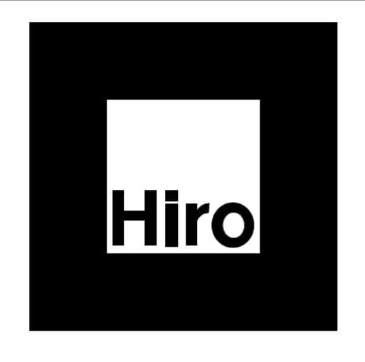

# **J.A.R.V.I.S**
## *Just A Rather Very Intelligent System.*
---
##  This is a group Summer Design Project for our Semester 5. It is an Augmented Reality and AI Powered Web App. 
---
## Try it out here: [J.A.R.V.I.S.](https://jarvis-iiitv.herokuapp.com/)
---
## Teammates: 
 - ## [Kushang Shah](https://www.linkedin.com/in/kushang-shah-85a250181/)  
 - ## [Pallavi Sharma](https://www.linkedin.com/in/pallavi11/)   
 - ## [Nitesh Pachlashiya](https://www.linkedin.com/in/nitesh-pachlashiya-794452199/)
---
## Repository 2 (Majorly AR Part): [Project-AI-AR](https://github.com/Kelta-King/Project-AI-AR)

---

## Demo Video: [Watch Here](https://drive.google.com/file/d/1UPrEVpTlDTWMw0zLZNLI4spf8uuK6YC7/view?usp=sharing)
---
## Preview:

---
## **How to use**: 
### - Create your account [here](https://jarvis-iiitv.herokuapp.com/).
### - Confirm your email address in order to get your account activated.
### - After confirming your account, you'll be automatically logged in.
### - After logging in, you'll be able to see a "Click Here" button below   the image of JARVIS. Click on the button and you'll be redirected to a new tab!
### - Allow the web cam and microphone permissions asked by Chrome App.
### - Place an image of **Hiro Marker** in front of your camera.
### - Press on "Start Recording" Button, say the voice command and Enjoy!
---
### Download the Hiro Marker Image:

---
## **Voice Commands**:
### - "Open Google", "Open YouTube" and "Open GitHub"
### - "Dance Please"
### - "Open Snake Game" and "Open Dude Run Game"
### - "WhatsApp <name_here> Message <content_here>"
### - "Email <name_here> Message <content_here>"
### - "Sing a Song for me" or "Play Music"
---
## **Major Languages**:    &  
 
---
## Technologies Used: **Augmented Reality** and a bit taste of **Artificial Intelligence**
---

## Frameworks and Libraries: **AR.js** and **A-Frame**.
---
## Backend:   
---

## Database:    
---
## Deployed on:  
---
<!-- --- -->
<!-- 
>Home Page:
---
.png)

---
> Result Page: (Find yours)
---
.png)

---
> Error 404 Page:
.png) -->

<!-- --- -->

### Connect with me on LinkedIn: **[Anubhav Madhav](https://www.linkedin.com/in/anubhav-madhav/)**

## Thank You!!

